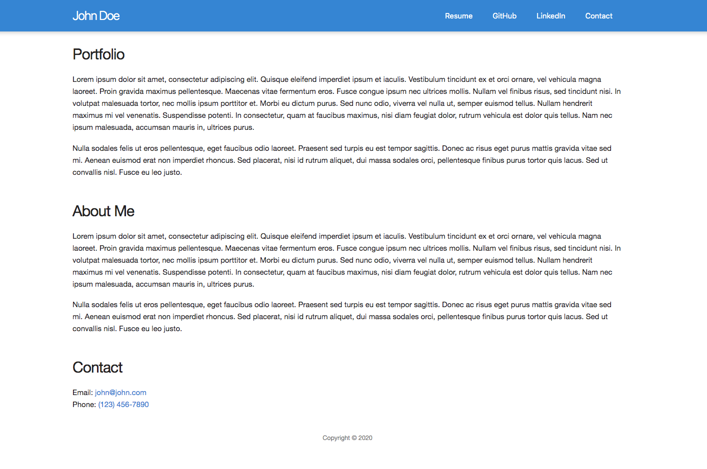

## 1.2 JSX

In this activity we are going to convert HTML to ReactJS using JSX Syntax.

# Instructions

* If you haven't done so already, create a folder called `reactworkshop` separate from this repository that you can use for all of the activities in this repo.

* Copy the entire `src` folder with [Unsolved/src](Unsolved/src) and paste it into your `reactworkshop` folder.

* Install node packages if you haven't done so already by running the command `npm install` from within the [Unsolved/src](Unsolved/src) folder.

* Stop the dev server if it is already running. Start the app in dev mode by running `npm start`.

* Now open and study the included files in the [Images](Images) folder. You are provided a screenshot and an HTML file.

* Using those as a reference, reproduce the same thing by using JSX syntax.

* NOTEYou do not need to create components for this activity, although it is a bonus if time permits.

### Hints

* You can use Fragments to let you group child nodes to create a single parent level element without adding extra nodes to the DOM. To learn more, go to section on [Fragments](https://reactjs.org/docs/fragments.html) in React's Documentation.

* Remember to use `className` instead of `class`.

### Bonus

* Create components for each of the sections on the page.